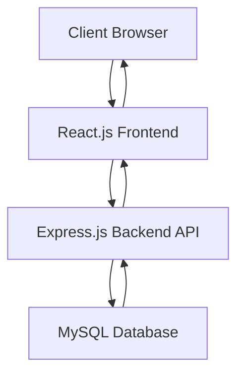

# Modern Full-Stack TODO Application Architecture

## Project Overview

A full-stack TODO application built with Node.js (backend), React.js (frontend), MySQL database, and a responsive UI using Tailwind CSS. The application follows MCP context7 patterns for code organization and implements complete CRUD functionality for todo items.

## Technology Stack

- **Backend**: Node.js with Express.js
- **Frontend**: React.js with Tailwind CSS
- **Database**: MySQL
- **Styling**: Tailwind CSS
- **Migration Tool**: Knex.js
- **Environment Management**: dotenv
- **Language**: JavaScript ES6+

## Project Structure

```
todo-app/
├── backend/
│   ├── controllers/
│   ├── models/
│   ├── routes/
│   ├── middleware/
│   ├── config/
│   ├── migrations/
│   └── utils/
├── src/
│   ├── components/
│   ├── services/
│   ├── App.js
│   ├── App.css
│   ├── index.js
│   └── index.css
├── public/
│   └── index.html
├── build/
├── database/
│   └── migrations/
├── docs/
├── config/
│   ├── development.env
│   └── staging.env
├── scripts/
├── tests/
├── .env
├── .env.example
├── .gitignore
├── knexfile.js
├── package.json
├── README.md
└── server.js
```

## Database Schema Design

### Todos Table

```sql
CREATE TABLE todos (
  id INT AUTO_INCREMENT PRIMARY KEY,
  title VARCHAR(255) NOT NULL,
  description TEXT,
  status ENUM('pending', 'in_progress', 'completed') DEFAULT 'pending',
  priority ENUM('low', 'medium', 'high') DEFAULT 'medium',
  created_at TIMESTAMP DEFAULT CURRENT_TIMESTAMP,
  updated_at TIMESTAMP DEFAULT CURRENT_TIMESTAMP ON UPDATE CURRENT_TIMESTAMP
);
```

## API Endpoints

### RESTful Routes for Todos

- `GET /api/todos` - Retrieve all todos
- `GET /api/todos/:id` - Retrieve a specific todo
- `POST /api/todos` - Create a new todo
- `PUT /api/todos/:id` - Update a todo
- `DELETE /api/todos/:id` - Delete a todo
- `PATCH /api/todos/:id/status` - Update todo status

## Environment Configuration

### Development Environment (.env.development)

- Database connection settings for local development
- Debug logging enabled
- Development-specific API endpoints

### Staging Environment (.env.staging)

- Database connection settings for staging server
- Production-like configuration
- Error reporting settings

## Data Flow Architecture



## Component Responsibilities

### Backend Components

1. **Controllers**: Handle HTTP requests and responses
2. **Models**: Database interaction and business logic
3. **Routes**: Define API endpoints
4. **Middleware**: Authentication, validation, error handling
5. **Config**: Database and application configuration

### Frontend Components

1. **Components**: Reusable React components for UI elements
2. **Services**: API service layer for backend communication
3. **Public**: Static assets (HTML template)

## Migration Strategy

Using Knex.js for database migrations:

- Version-controlled schema changes
- Up/down migration scripts
- Environment-specific migration runs

## Error Handling

- Centralized error handling middleware
- Validation for all incoming data
- Consistent error response format
- Logging for debugging and monitoring

## Deployment Considerations

- Environment-specific configurations
- Database migration automation
- Health check endpoints
- Performance optimization
- Security best practices

## MCP Context7 Patterns

Following MCP context7 patterns for:

- Modular code organization
- Separation of concerns
- Reusable components
- Maintainable architecture

## Implementation Plan

To implement this architecture, we'll need to:

1. Create the directory structure as outlined above
2. Set up the package.json with necessary dependencies
3. Configure environment files for development and staging
4. Implement the database schema and migrations
5. Build the Express.js backend with RESTful API endpoints
6. Create the React.js frontend with responsive UI using Tailwind CSS
7. Implement full CRUD functionality for todos
8. Add comprehensive error handling and validation
9. Create documentation and prepare for deployment
